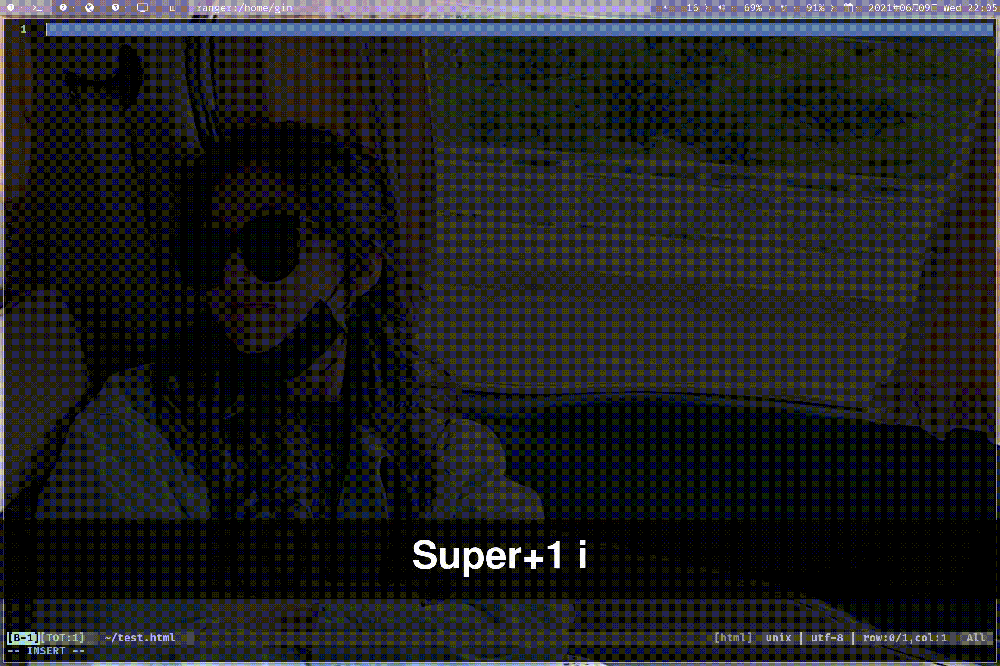
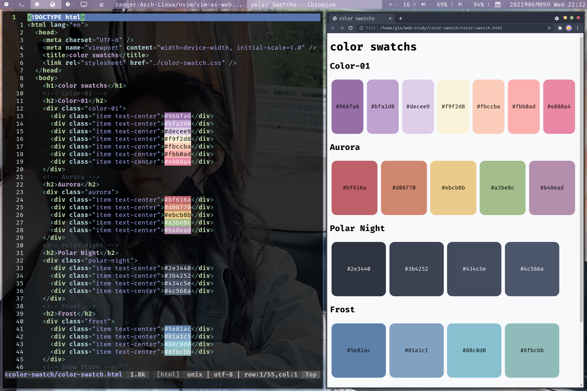
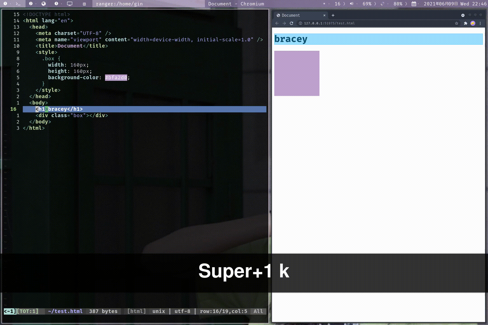
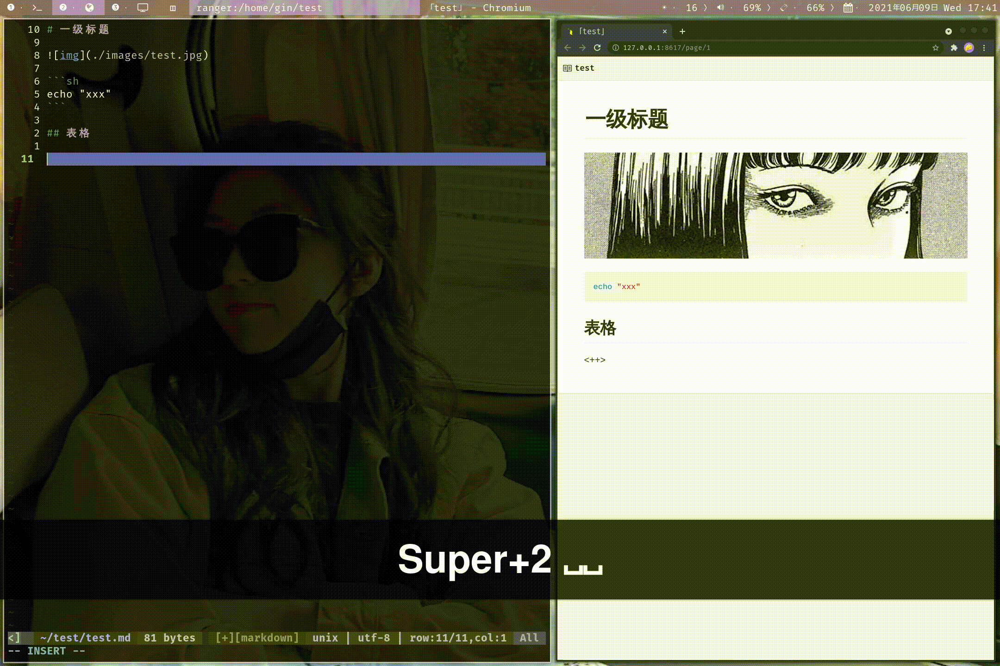
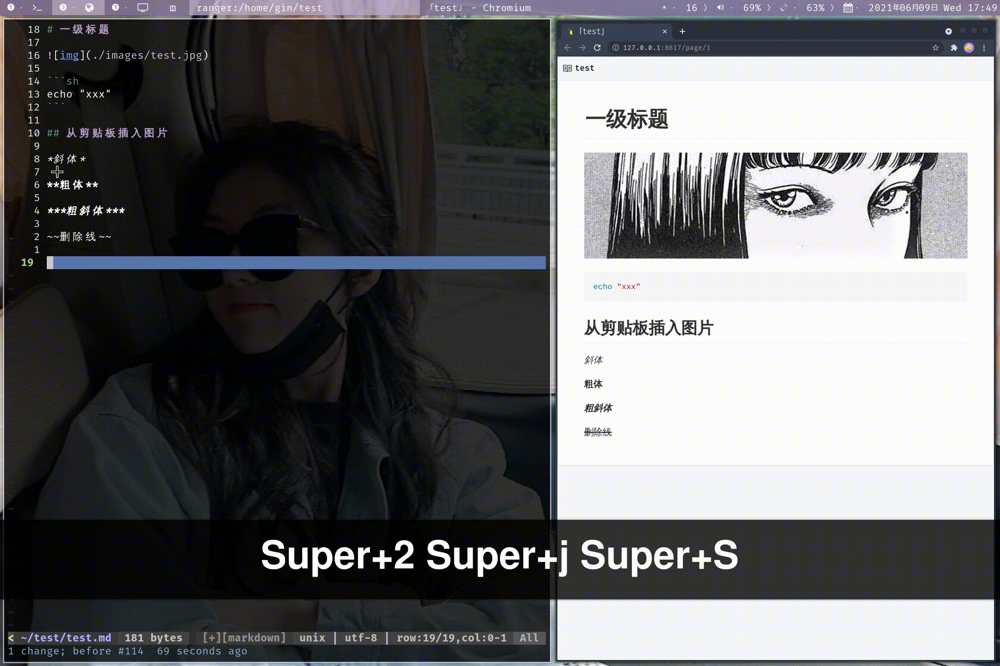
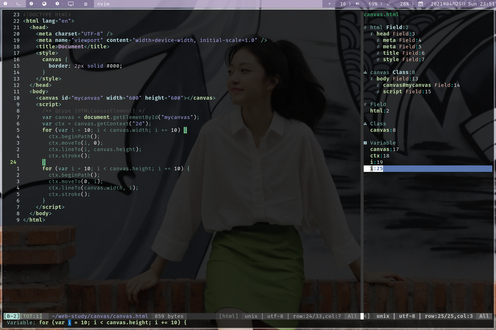
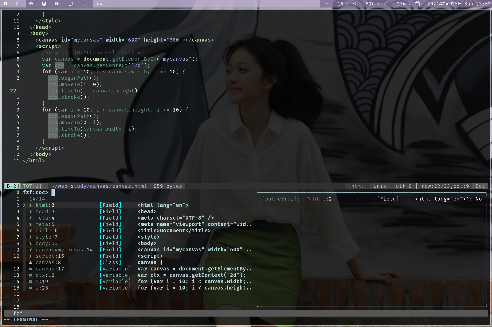

# neovim配置 (前端开发 + markdown编辑)

* [neovim配置 (前端开发 + markdown编辑)](#neovim配置-前端开发--markdown编辑)
   * [1. 依赖](#1-依赖)
      * [npm安装neovim](#npm安装neovim)
      * [pip安装pynvim](#pip安装pynvim)
   * [2. 快捷键](#2-快捷键)
   * [3. 前端开发](#3-前端开发)
      * [自动补全](#自动补全)
      * [颜色显示](#颜色显示)
      * [代码片段](#代码片段)
      * [自动刷新页面](#自动刷新页面)
   * [4. markdown编辑](#4-markdown编辑)
      * [快速输入](#快速输入)
      * [markdown预览](#markdown预览)
      * [表格模板](#表格模板)
      * [从剪贴板插入图片](#从剪贴板插入图片)
   * [5. 其他插件](#5-其他插件)
      * [fzf(模糊搜索)](#fzf模糊搜索)
      * [nerdtree(文件浏览)](#nerdtree文件浏览)
      * [vista(tags工具)](#vistatags工具)
      * [dict(翻译)](#dict翻译)

## 1. 依赖

使用配置之前确保安装了以下软件包。

```
1. nodejs
2. npm
3. yarn
4. python3
5. pip
6. nerd-fonts
7. ctags
8. fzf
9. bat
10. the_silver_searcher
11. xclip
```

### npm安装neovim

```
sudo npm install -g neovim
```

### pip安装pynvim

```
pip3 install --user pynvim

pip install --user pynvim
```

## 2. 快捷键

`leader`键为`空格键`。

| 快捷键            | 描述                           |
|-------------------|--------------------------------|
| `s`               | 保存                           |
| `shift` `s`       | 保存退出                       |
| `shift` `q`       | 不保存退出                     |
| `shift` `h`       | 光标移动到行首                   |
| `shift` `l`       | 光标移动到行尾                   |
| `shift` `j`       | 光标向下移动5行                |
| `shift` `k`       | 光标向上移动5行                |
| `leader` `left`   | 左右分屏，光标在左分屏         |
| `leader` `down`   | 上下分屏，光标在下分屏         |
| `alt` `shift` `h` | 光标移动到左分屏               |
| `alt` `shift` `j` | 光标移动到下分屏               |
| `alt` `shift` `k` | 光标移动到上分屏               |
| `alt` `shift` `l` | 光标移动到右分屏               |
| `shift` `up`      | 上下分屏时，增加分屏高度       |
| `shift` `down`    | 上下分屏时，减少分屏高度       |
| `shift` `left`    | 左右分屏时，增加分屏宽度       |
| `shift` `right`   | 左右分屏时，减少分屏宽度       |
| `leader` `n` `t`  | 打开一个新标签                 |
| `tab` `h`         | 切换到上一个标签               |
| `tab` `l`         | 切换到下一个标签               |
| `alt` `t`         | 在底部打开一个终端             |
| `Y`               | 在可视模式下，复制到系统剪贴板 |
| `alt` `p`         | 从系统剪贴板粘贴               |
| `leader` `n` `h`  | 取消搜索结果的高亮             |
| `leader` `s` `c`  | 打开拼写检查                   |

## 3. 前端开发

### 自动补全

---

插件地址：[coc.nvim](https://github.com/neoclide/coc.nvim)

| 键位             | 描述                       |
|------------------|----------------------------|
| `tab`            | 向下高亮补全项             |
| `shift` `tab`    | 向上高亮补全项             |
| `enter`          | 选择高亮的补全项           |
| `leader` `g` `d` | 跳转到变量或函数定义的地方 |
| `leader` `g` `r` | 跳转到代码错误的地方       |

在`plugin/coc.vim`文件中可以修改配置。



### 颜色显示

---

插件地址：[coc-highlight](https://github.com/neoclide/coc-highlight)

在vim中显示颜色。



### 代码片段

---

插件地址：[coc-sinppets](https://github.com/neoclide/coc-snippets)

在`UltiSnips`目录下可以添加自定义的代码片段。

例：

添加一个shell脚本的开头的代码片段：`sh.sinppets`。

```sh
snippet sh "shell heading"
#!/bin/bash

# Author: ${1:gin}
# CreateDate: <++>
# Description: <++>

<++>
endsnippet
```


### 自动刷新页面

---

插件地址：[bracey.vim](https://github.com/turbio/bracey.vim)

| 快捷键    | 描述       |
|-----------|------------|
| `alt` `i` | 启动bracey |



## 4. markdown编辑

### 快速输入

---

在`插入模式(insert-mode)`下，markdown输入快捷键。

| 快捷键  | 描述                           |
|---------|--------------------------------|
| `,` `f` | 查找下一个`<++>`并进入插入模式 |
| `,` `1` | 输入一级标题                   |
| `,` `2` | 输入二级标题                   |
| `,` `3` | 输入三级标题                   |
| `,` `4` | 输入四级标题                   |
| `,` `5` | 输入五级标题                   |
| `,` `6` | 输入六级标题                   |
| `,` `i` | 输入斜体文本                   |
| `,` `s` | 输入粗体文本                   |
| `,` `e` | 输入粗斜体文本                 |
| `,` `d` | 输入删除线                     |
| `,` `p` | 插入图片                       |
| `,` `a` | 插入链接                       |
| `,` `n` | 插入分隔线                     |
| `,` `c` | 插入代码块                     |
| `,` `m` | 使用反引号包裹                 |

在`plugin/markdown-quick-input.vim`文件中可以修改配置。


### markdown预览

---

插件地址：[markdown-preview.nvim](https://github.com/iamcco/markdown-preview.nvim)

| 快捷键    | 描述     |
|-----------|----------|
| `alt` `m` | 打开预览 |

配置中使用`chromium`浏览器作为预览工具。

在`plugin/markdown-preview.vim`文件中可以修改配置。


### 表格模板

---

插件地址：[vim-table-mode](https://github.com/dhruvasagar/vim-table-mode)

| 快捷键            | 描述             |
|-------------------|------------------|
| `alt` `shift` `t` | 启动表格模板     |
| `alt` `shift` `r` | 表格模板重新对齐 |

在`plugin/table-mode.vim`文件中可以修改配置。

在`插入模式(insert-mode)`下，输入`mtb`可以快速生成表格。



### 从剪贴板插入图片

---

插件地址：[md-img-paste.vim](https://github.com/ferrine/md-img-paste.vim)

| 快捷键       | 描述           |
|--------------|----------------|
| `leader` `p` | 输入图片的名称 |
---


## 5. 其他插件

**插件管理器**：[vim-plug](https://github.com/junegunn/vim-plug)

### fzf(模糊搜索)

---

**插件地址**：[fzf.vim](https://github.com/junegunn/fzf.vim)

| 快捷键     | 描述                 |
|------------|----------------------|
| `alt` `f`  | 查找文件             |
| `alt` `b`  | 查找Buffers          |
| `alt` `h`  | 查找最近打开过的文件 |
| `ctrl` `j` | 向下移动一格         |
| `ctrl` `k` | 向上移动一格         |


### nerdtree(文件浏览)

---

**插件地址**：[nerdtree](https://github.com/preservim/nerdtree)

| 快捷键    | 描述           |
|-----------|----------------|
| `alt` `e` | 打开nerdtree   |
| `q`       | 退出nerdtree   |
| `?`       | 打开帮助文档   |
| `o`       | 打开目录或文件 |
| `I`       | 显示隐藏文件   |
| `u`       | 返回上一级目录 |
| `m`       | 打开菜单       |


### vista(tags工具)

---

**插件地址**：[vista.vim](https://github.com/liuchengxu/vista.vim)

| 快捷键            | 描述          |
|-------------------|---------------|
| `alt` `v`         | 打开vista     |
| `alt` `shift` `v` | 打开vista搜索 |
| `q`               | 退出vista     |
| `p`               | 预览          |





### dict(翻译)

---

**插件地址**：[dict.vim](https://github.com/iamcco/dict.vim)

| 快捷键       | 描述                   |
|--------------|------------------------|
| `alt` `w`    | 输入需要翻译的单词     |
| `leader` `t` | 翻译当前光标下的单词   |
| `leader` `r` | 翻译并替换光标下的单词 |


