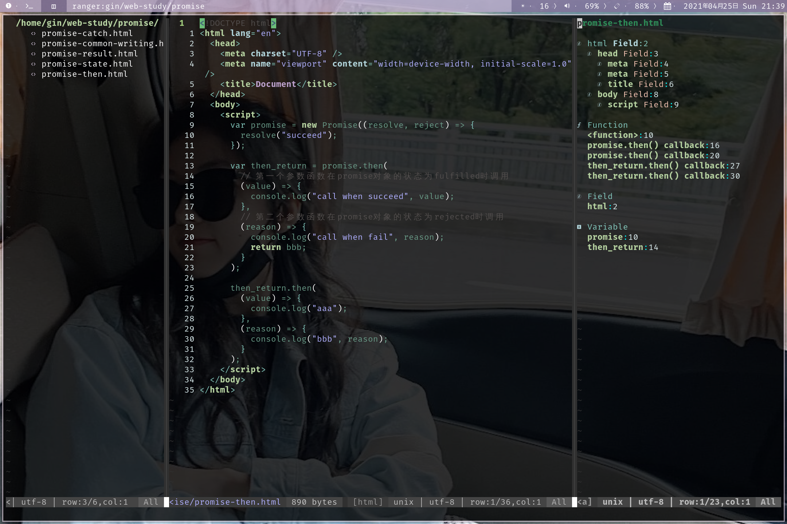
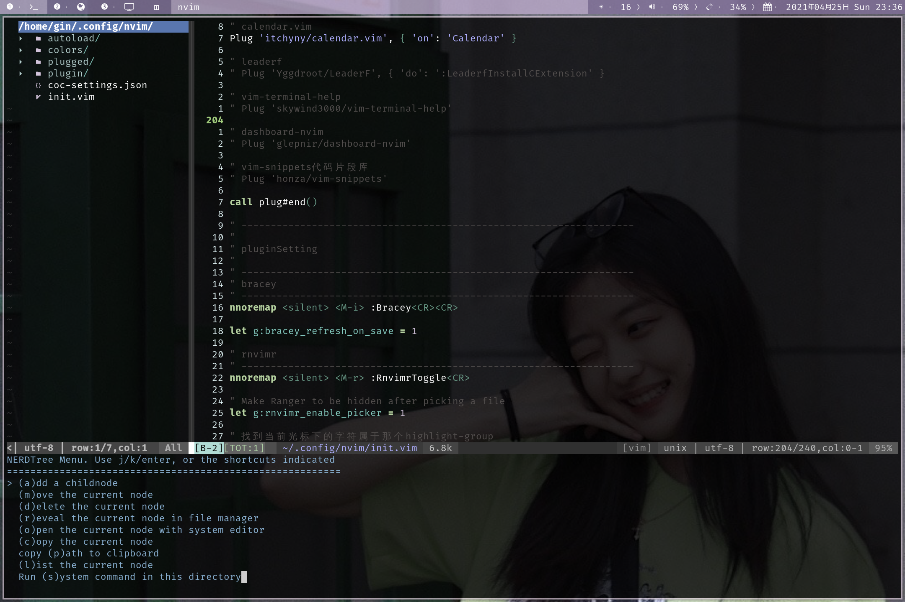
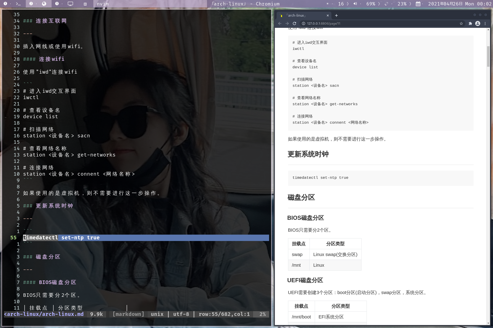
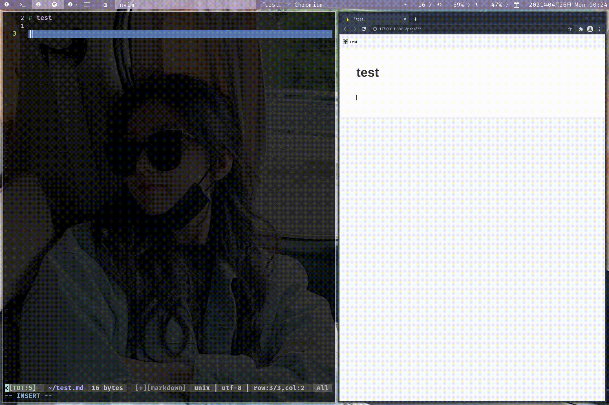

## 一个方便前端开发的neovim配置



## 依赖

使用配置之前确保安装了以下软件包。

```
1. nodejs
2. npm
3. yarn
4. python3
5. pip
6. nerd-fonts
7. ctags
8. fzf
9. bat
10. ag(the_silver_searcher)
11. xclip
```

### npm安装neovim

```
sudo npm install -g neovim
```

### pip安装pynvim

```
pip3 install --user pynvim

pip install --user pynvim
```

## 快捷键

`leader`键为`空格键`。

| 快捷键            | 描述                           |
|-------------------|--------------------------------|
| `s`               | 保存                           |
| `S`               | 保存退出                       |
| `Q`               | 不保存退出                     |
| `H`               | 光标跳到行首                   |
| `L`               | 光标跳到行尾                   |
| `J`               | 光标向下移动5行                |
| `K`               | 光标向上移动5行                |
| `leader` `left`   | 左右分屏，光标在左分屏         |
| `leader` `down`   | 上下分屏，光标在下分屏         |
| `alt` `shift` `h` | 光标移动到左分屏               |
| `alt` `shift` `j` | 光标移动到下分屏               |
| `alt` `shift` `k` | 光标移动到上分屏               |
| `alt` `shift` `l` | 光标移动到右分屏               |
| `shift` `up`      | 上下分屏时，增加分屏高度       |
| `shift` `down`    | 上下分屏时，减少分屏高度       |
| `shift` `left`    | 左右分屏时，增加分屏宽度       |
| `shift` `right`   | 左右分屏时，减少分屏宽度       |
| `leader` `n` `t`  | 打开一个新标签                 |
| `tab` `h`         | 切换到上一个标签               |
| `tab` `l`         | 切换到下一个标签               |
| `alt` `t`         | 在底部打开一个终端             |
| `Y`               | 在可视模式下，复制到系统剪贴板 |
| `alt` `p`         | 从系统剪贴板粘贴               |
| `leader` `n` `h`  | 取消搜索结果的高亮             |
| `leader` `s` `c`  | 打开拼写检查                   |

## 插件

**插件管理器**：[vim-plug](https://github.com/junegunn/vim-plug)

### coc(自动补全)

---

**插件地址**：[coc.nvim](https://github.com/neoclide/coc.nvim)

| 快捷键           | 描述                     |
|------------------|--------------------------|
| `leader` `g` `d` | 跳转到函数定义的地方     |
| `leader` `g` `r` | 跳转到代码报错的地方     |
| `leader` `k`     | 显示当前光标下单词的文档 |


### bracey(自动刷新页面)

---

**插件地址**：[bracey.vim](https://github.com/turbio/bracey.vim)

| 快捷键    | 描述       |
|-----------|------------|
| `alt` `i` | 启动bracey |


### fzf(模糊搜索)

---

**插件地址**：[fzf.vim](https://github.com/junegunn/fzf.vim)

| 快捷键     | 描述                 |
|------------|----------------------|
| `alt` `f`  | 查找文件             |
| `alt` `b`  | 查找Buffers          |
| `alt` `h`  | 查找最近打开过的文件 |
| `ctrl` `j` | 向下移动一格         |
| `ctrl` `k` | 向上移动一格         |


### nerdtree(文件浏览)

---

**插件地址**：[nerdtree](https://github.com/preservim/nerdtree)

| 快捷键    | 描述           |
|-----------|----------------|
| `alt` `e` | 打开nerdtree   |
| `q`       | 退出nerdtree   |
| `?`       | 打开帮助文档   |
| `o`       | 打开目录或文件 |
| `I`       | 显示隐藏文件   |
| `u`       | 返回上一级目录 |
| `m`       | 打开菜单       |



### vista(tags工具)

---

**插件地址**：[vista.vim](https://github.com/liuchengxu/vista.vim)

| 快捷键            | 描述          |
|-------------------|---------------|
| `alt` `v`         | 打开vista     |
| `alt` `shift` `v` | 打开vista搜索 |
| `q`               | 退出vista     |
| `p`               | 预览          |


### markdown-preview(markdown预览)

---

**插件地址**：[markdown-preview.nvim](https://github.com/iamcco/markdown-preview.nvim)

| 快捷键    | 描述                 |
|-----------|----------------------|
| `alt` `m` | 打开markdown-preview |

使用`chromium`浏览器预览，可以在`plugin/markdown-preview.vim`中修改。



### vim-table-mode(表格模板)

---

**插件地址**：[vim-table-mode](https://github.com/dhruvasagar/vim-table-mode)

| 快捷键            | 描述               |
|-------------------|--------------------|
| `alt` `shift` `t` | 打开vim-table-mode |



### dict(翻译)

---

**插件地址**：[dict.vim](https://github.com/iamcco/dict.vim)

| 快捷键       | 描述                   |
|--------------|------------------------|
| `alt` `w`    | 输入需要翻译的单词     |
| `leader` `t` | 翻译当前光标下的单词   |
| `leader` `r` | 翻译并替换光标下的单词 |


